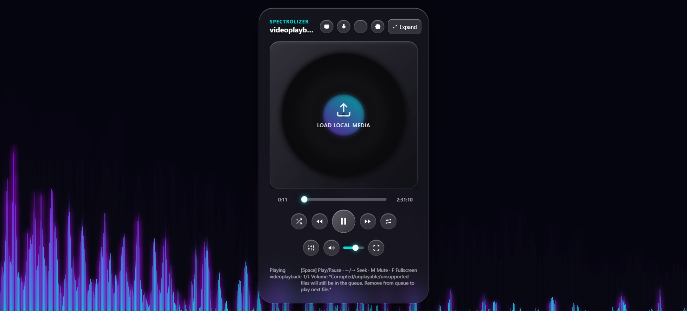
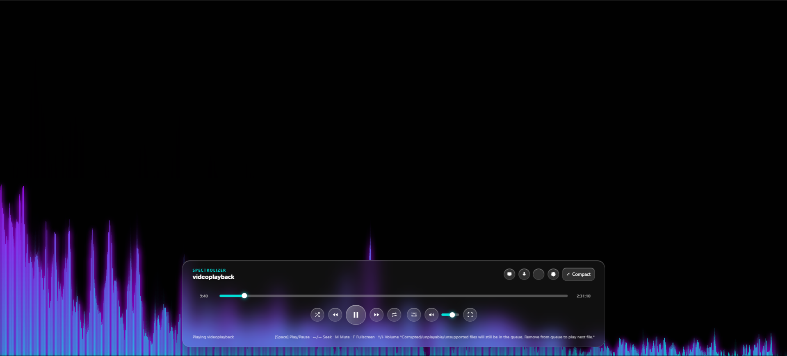
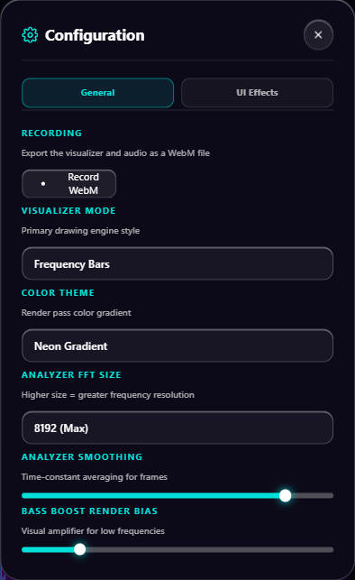
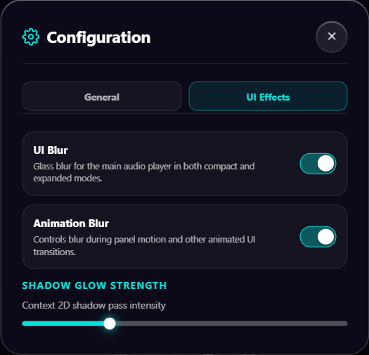

# 🎵 AI* Audio Visualizer

A modern, browser-based audio visualizer with real-time music visualization, customizable visual effects, audio controls, EQ, PWA support, and more.

🌐 **Live Demo:**  
https://hongyuekai427-bit.github.io/AI-audio-visualizer/

## Screenshots

### Main
<p align="center">
  
  
</p>

### Queue & Settings
<p align="center">
  
  
  
  
</p>
---

## ✨ Features

### Audio Player
- Local audio file playback
- Drag-and-drop audio loading
- Playlist / queue management
- Shuffle
- Repeat / loop modes
- Previous / next track controls
- Playback progress and volume controls

### Audio Visualization
- Real-time audio-reactive visualizations
- Multiple visualization modes
- Dynamic visual effects
- Fullscreen visualization
- Responsive visualizer rendering

### UI & Visual Effects
- Customizable themes
- Glow effects
- UI blur controls
- Animation blur controls
- Adjustable visual effects
- Responsive glass-style interface
- Smooth UI animations

### Audio Effects
- Equalizer
- Bass boost
- Audio-reactive effects
- Microphone audio support
- System audio capture support where supported by the browser

### Settings
Settings are separated into dedicated sections to keep customization organized.

#### UI Effects

Controls the appearance of the main audio player interface and its visual elements.

#### Animation Effects

Controls blur and other effects used during visual animations.

Settings are designed to let users reduce visual effects when they prefer a simpler or more performance-friendly interface.

### Progressive Web App

The project includes PWA functionality through:

- `manifest.json`
- Service worker support
- Installable web application support
- Offline caching where supported

---

## 🔒 Privacy

This project is designed to work primarily on the client side.

Audio files can be loaded directly in the browser without requiring an account or a dedicated backend service.

The project does not intentionally require users to upload their local music to a server for visualization.

> Browser APIs such as microphone or system-audio capture are subject to browser permissions and platform limitations.

---

## Getting Started

### Use the Live Demo

The easiest way to use the project is through the hosted version:

**https://hongyuekai427-bit.github.io/AI-audio-visualizer/**

1. Open the website.
2. Load an audio file.
3. Start playback.
4. Select a visualization mode.
5. Customize the visual effects and audio settings.
6. Enjoy.

### Run Locally

Clone the repository:

```bash
git clone https://github.com/hongyuekai427-bit/AI-audio-visualizer.git
```

*AI in the header means the AI built the web app, only.
